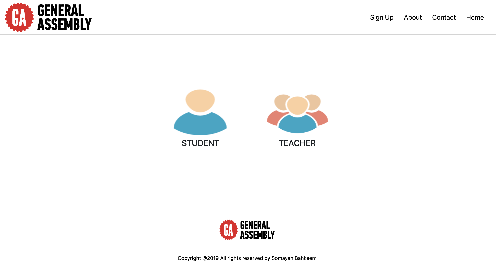
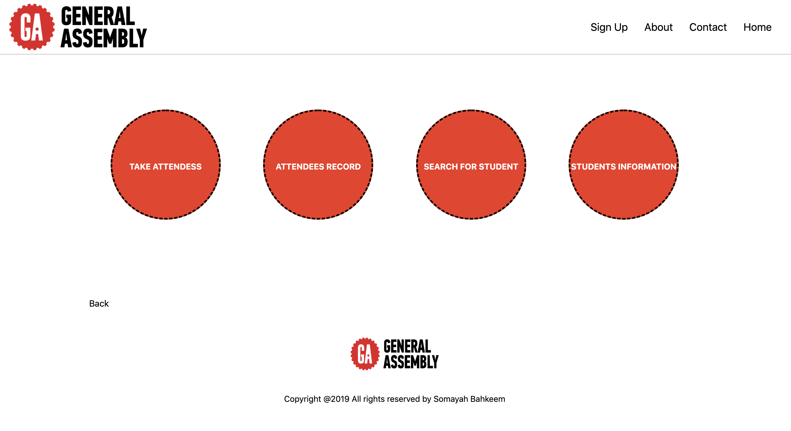
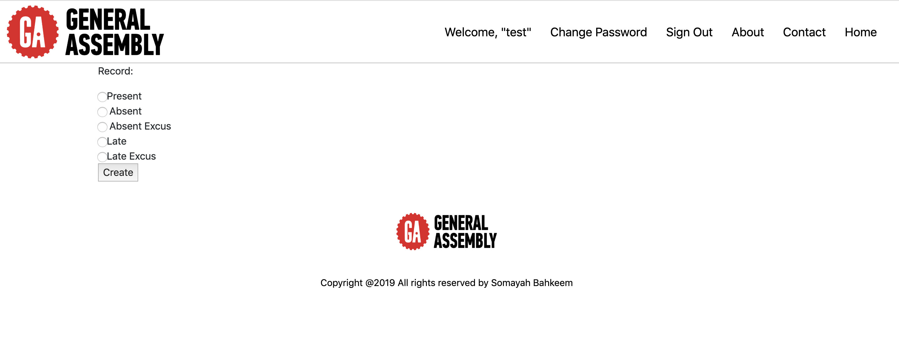
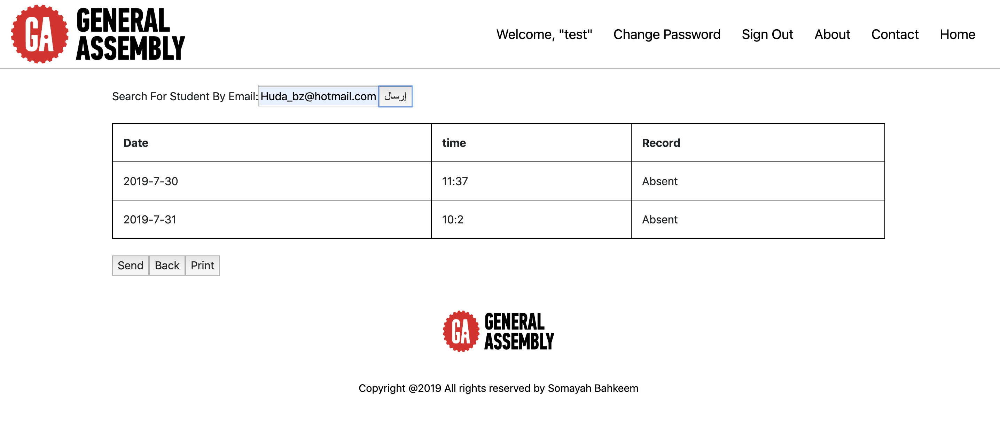
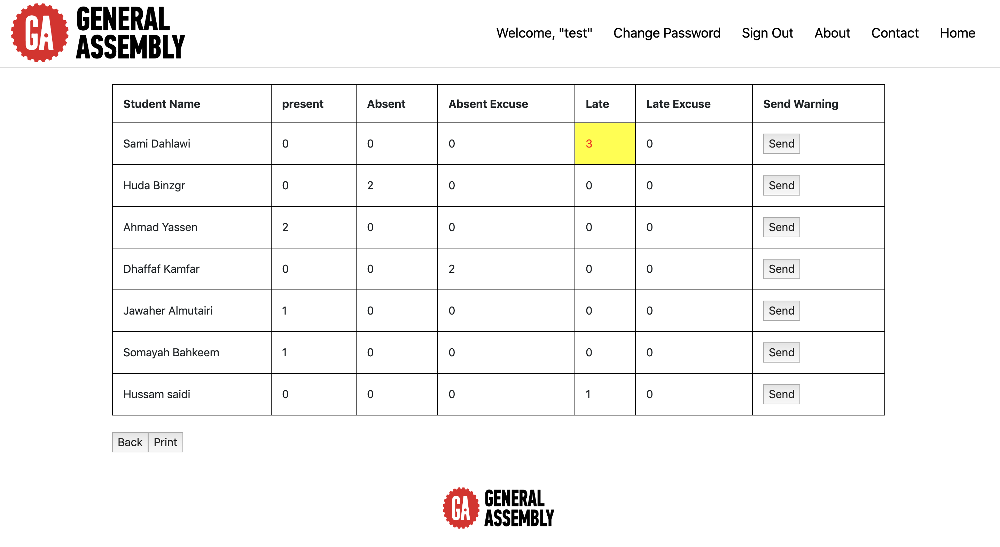
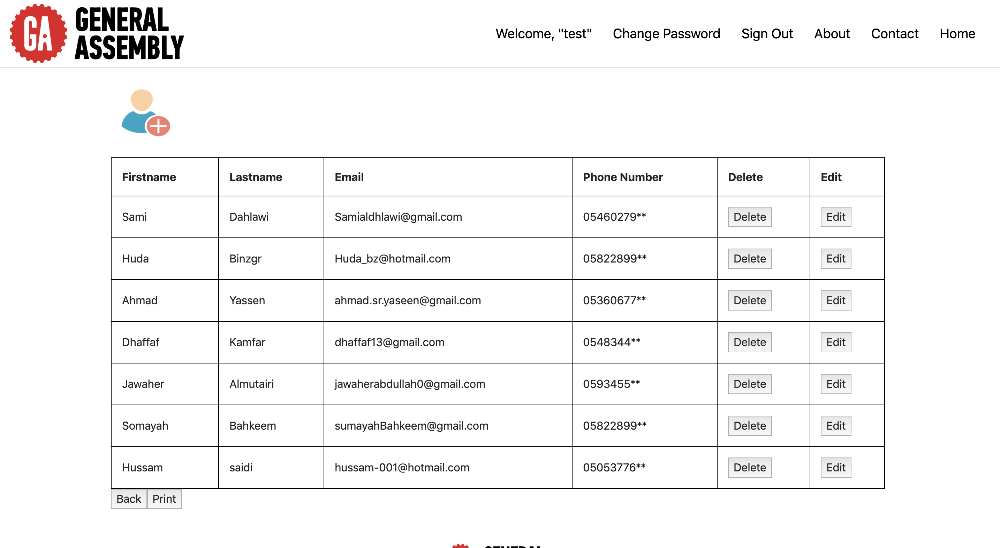
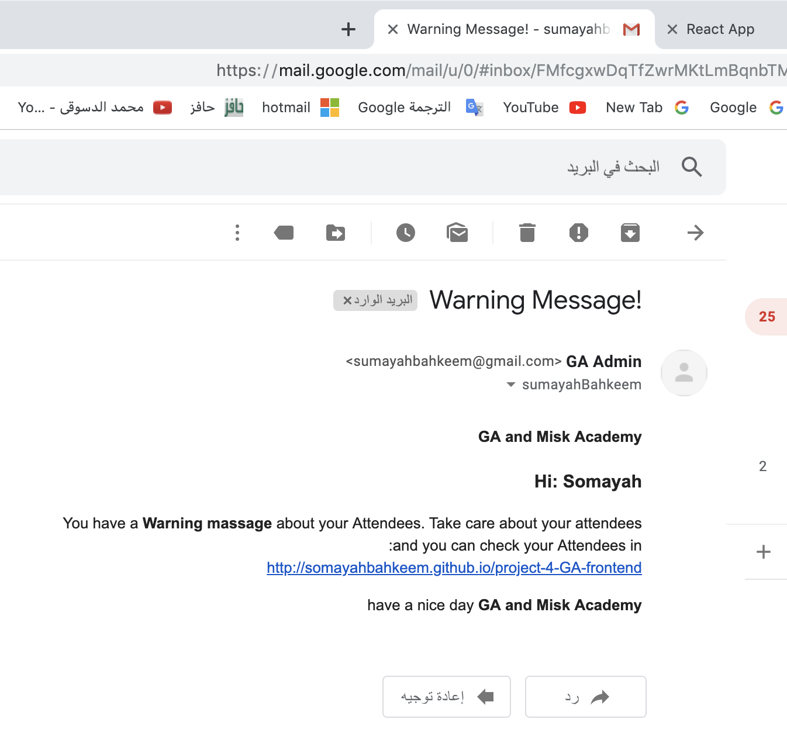

# ATTENDEES SYSTEM


## Web Application Description 


---
## Prerequisites

npm  
```
$ npm install
```

Run server
```
$npm start
```

---
## User Stories


## Wireframes


















## Technologies
Print the Page
```
printFunction =()=> {
    window.print();
    }
onClick ={this.printFunction}
```
Send Warning Email

Express code:
```
https://medium.com/@tariqul.islam.rony/sending-email-through-express-js-using-node-and-nodemailer-with-custom-functionality-a999bb7cd13c
```
Reactjs code:
```
export const studentSearch = (email) => {
    return  Axios({
        method:'GET',
        url: apiUrl + '/students/search/' + email,
    })
}
```
## Developers
Name:Somayah Marwan Bahkeem
Email:SumayahBahkeem.
phone#:0505366288.
LinkedIn:Somayah Bahkeem